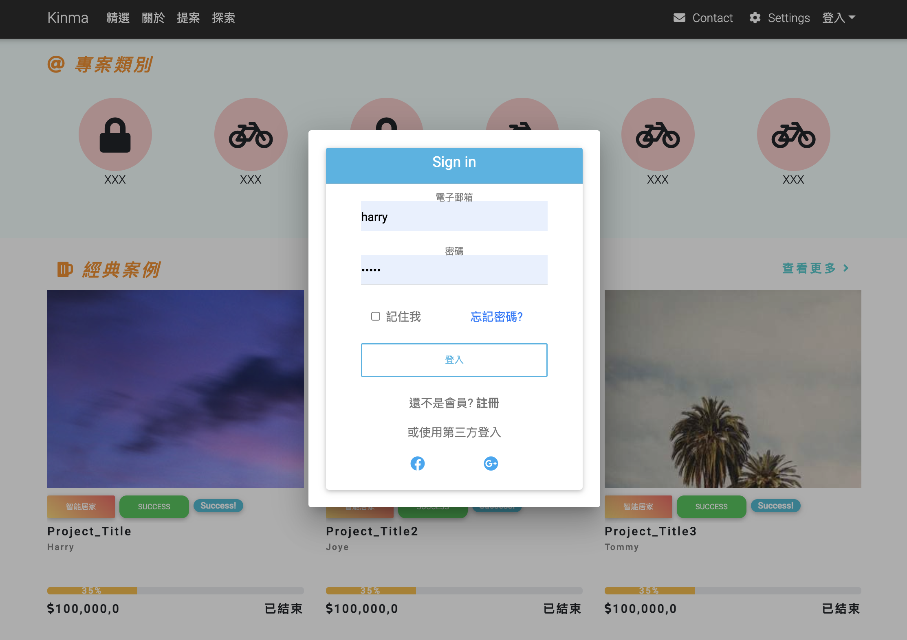

# Kinma-Project


**Kinma Project is design for product funding platform.**

Using **Golang** as a backend server, AngularJS as a frontend UI

#



# Integration with AWS
**kinma-golangBackend** branch is used for continuous development

 [The EC2 service on AWS has been suspend for now]  
**kinma-golangBackend-deploy** will deploy the IMG to AWS register by `deploy.yml`, Pull Request is the only way to deploy the new image.

# Launch kinma service on local

  ```
  git clone https://github.com/ZoengYu/Kinma-Project.git
  cd Kinma-Project 
  ```

`docker-compose build` will build postgres db, AngularUI, Golang backend api service

`docker-compose up` to launch all service
  #
- Launch db
 ```
make postgres
```
- Create kinma_db
 ```
make createdb
```
- migrate the db
```
make migrateup
```
- clean up the migration
```
make migratedown
```
- Launch the API Server
```
make server
```

#
create database migration schema
```
migrate create -ext sql -dir db/migration -seq init_schema
```
